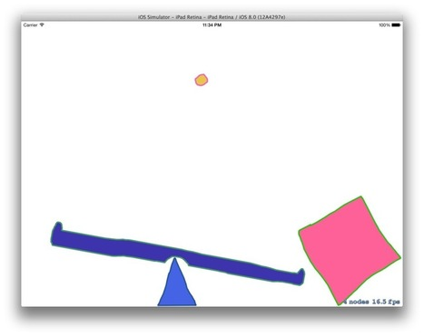

SwiftDrawnPhysics
=================

This is a fun little demo showing some neat tricks with Swift and SpriteKit.  The app allows you to draw any shape with your finger that will then be turned into a physics object with a mass based on the size of the object.  

